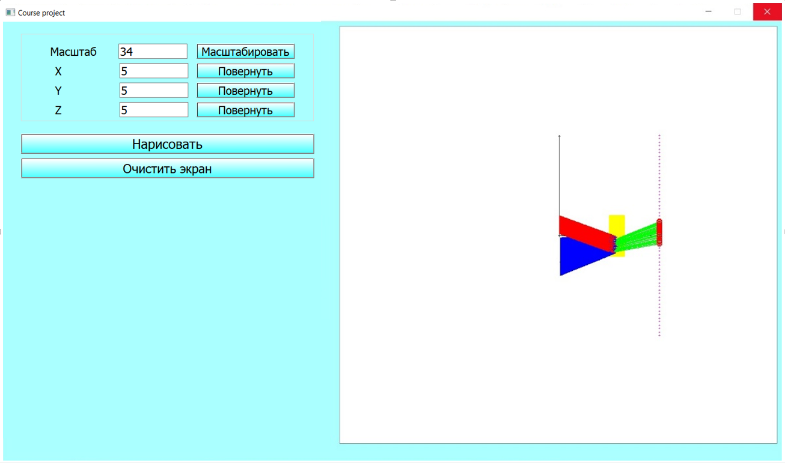
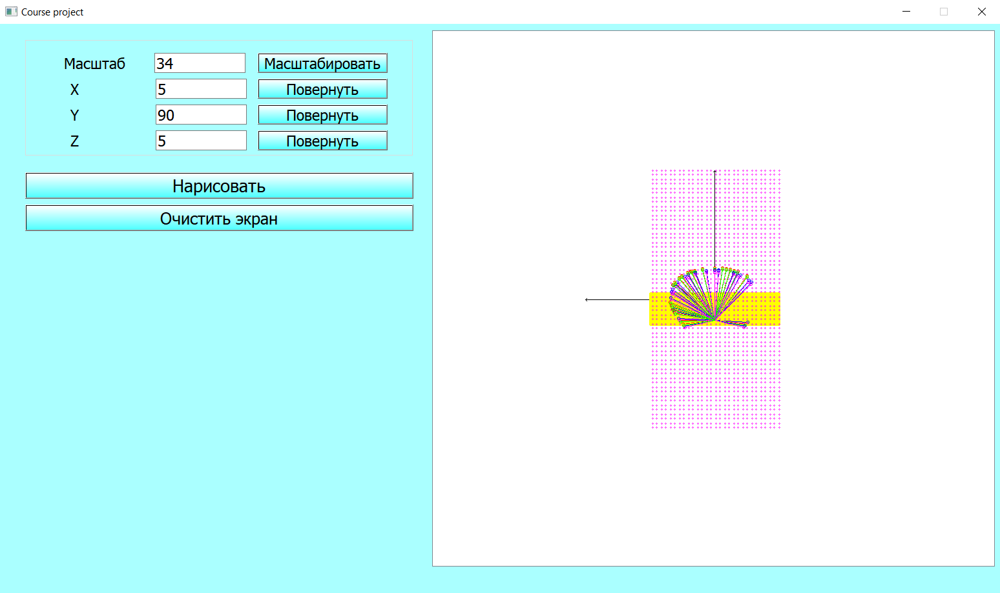

# Моделирование радуги с точки зрения физики

## Постановка задачи

Необходимо разработать программный продукт с пользовательским интерфейсом для моделирования радуги.  

## Общий алгоритм решения поставленной задачи

1. Задаем расположение глаза – (x_eye, y_eye, z_eye). В данной задаче глаз можно считать точечным приемником.  
2. Генерируем массив расположения капель. Каждая точка в заданном диапазоне (в параллелепипеде) попадает в массив капель с вероятностью 10%.  
3. Задаем плоскость горизонта. Считаем горизонт параллельным плоскости (oy, oz). То есть, задаем точку на оси x, где виден горизонт.  
4. Пускаем солнечные лучи (углы: alpha_x, alpha_y, alpha_z = 90, 0, 110).  
5. Перебираем все лучи. Для каждого луча:  
	5.1. Определяем, где луч должен кончиться (чтобы не обрабатывать лишнее) – самая дальняя используемая точка (находим координаты конца луча).  
	5.2. Определяем, пересекается ли текущий луч с какой-нибудь из капель.  
	5.3. Если пересечения нет, данный луч дальше не обрабатывается.  
	5.4. Если пересечение есть, раскладываем общий луч на цветовые - учитываем дисперсию, с учетом четырех возможных вариантов вхождения луча в каплю (по четвертям, т.к. изначально рассматривается вариант q_y = 0..0.5, q_z = 0..0.5) для каждого находим углы выходящего из капли луча.  
Находим координаты конца луча. Определяем, пересекается ли луч с глазом (с учетом раствора глаза). Если пересечение есть, продлеваем луч до пересечения с плоскостью горизонта, находим координаты точки, в которой будет видна радуга. С учетом яркости отрисовываем видимую точку радуги.

## Результаты

Смоделирована и запрограммирована часть, касающаяся движения лучей.  

Описанный алгоритм работает очень долго. Поэтому моделирование всех физических процессов (со всевозможными упрощениями) - очень затратная по времени операция. Если не задаваться целью смоделировать всю физику радуги, то радугу можно моделировать, основываясь на геометрических построениях. Можно сказать, что если мы нарисуем конус с осью от глаза, наклоненной под тем же углом, что и лучи, и углом при острие 2*42 градуса, то для каждой капли, лежащей на этом конусе, найдется луч, который отразится в этой капле одной из своих цветовых составляющих по направлению к вершине конуса. То есть, достаточно знать расположение глаза и горизонта и углы падения лучей, чтобы смоделировать радугу исходя из геометрических построений.

На рисунке представлен промежуточный результат работы программы – отрисовано множество капель, плоскость горизонта, исходные лучи, лучи, прошедшие два преломления и одно отражение в каплях, лучи, попавшие в глаз наблюдателя.  

